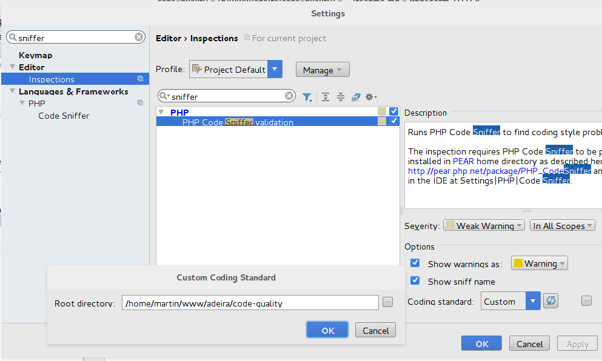

Add those rules into playbook of your favorite CI server. **You should create custom `ruleset.xml` with this content:**

```
<?xml version="1.0"?>
<ruleset>
	<rule ref="./vendor/adeira/code-quality/ruleset.xml"/>
</ruleset>
```

For Travis (similar for Gitlab-CI):

```
before_script:
  - vendor/bin/parallel-lint . -e php,php3,php4,php5,phtml,phpt --exclude vendor --blame

script:
  - vendor/bin/tester tests -C
  - vendor/bin/phpcs --standard=ruleset.xml --extensions=php --encoding=utf-8 --tab-width=4 -sp app/ src/ --ignore=bootstrap.php
  - vendor/bin/phpcs --standard=ruleset.xml --extensions=php,phpt --encoding=utf-8 --tab-width=4 -sp tests/ --ignore=*/output/*,_temp/*,bootstrap.php
```

Complete Travis example:

```
language: php

php:
  - 7.0
  - 7.1

before_script:
  - composer selfupdate --no-progress
  - travis_retry composer install --prefer-dist
  - vendor/bin/parallel-lint . -e php,php3,php4,php5,phtml,phpt --exclude vendor --blame

script:
  - vendor/bin/tester tests -C
  - vendor/bin/phpcs --standard=ruleset.xml --extensions=php --encoding=utf-8 --tab-width=4 -sp src/ --ignore=bootstrap.php
  - vendor/bin/phpcs --standard=ruleset.xml --extensions=php,phpt --encoding=utf-8 --tab-width=4 -sp tests/ --ignore=*/output/*,_temp/*,bootstrap.php

notifications:
  email: false
```

Setup your favorite editor. In my case it's PhpStorm. First setup code sniffer:


And then enable and setup rules for code sniffer:


